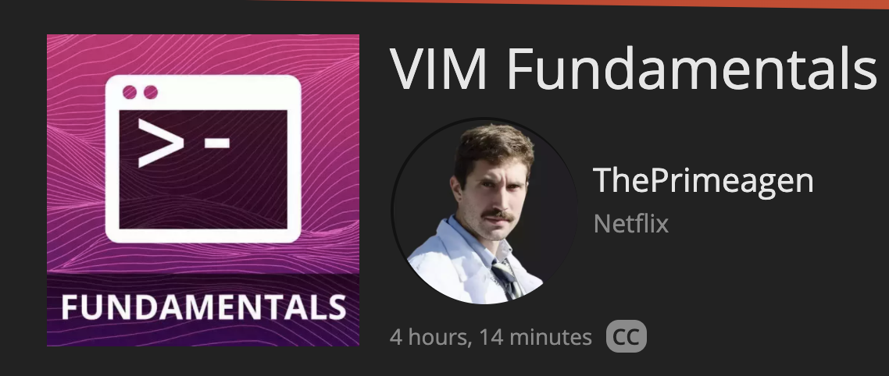

# My Vim Setup

Make sure you're using nvim 0.5.1 or >, as Telescope requires it.

I'm using this alias `alias vim='nvim` to ensure I'm always using the nvim version

## Getting Started

If you're unsure of how to use Vim, I highly suggest you drop what you're doing and watch the FrontEnd Masters course by ThePrimeagen.

<https://frontendmasters.com/courses/vim-fundamentals/>

## Setup

Download vim-pl
