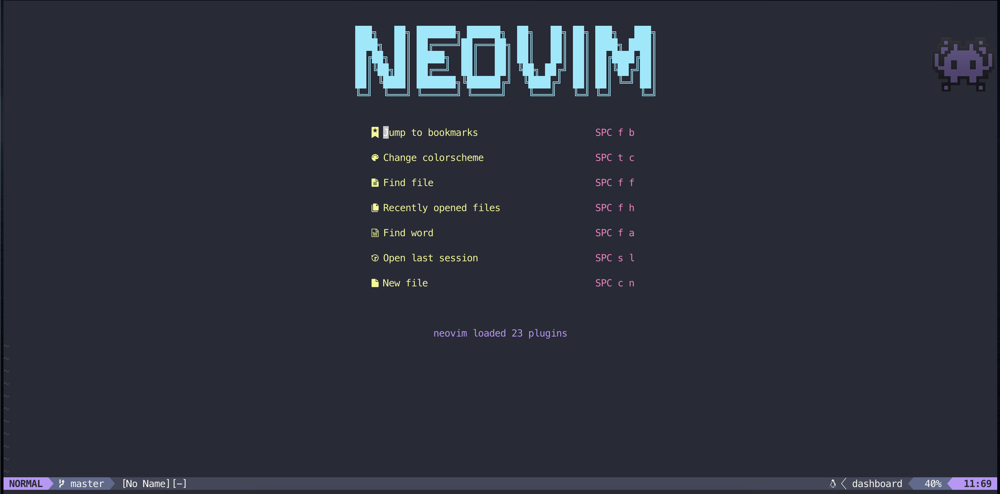

# My Vim Setup

I'll walk you through my vim setup - I can't direct you how to set this up on Linux/Windows but it should be roughly the same. Check the packages github pages for OS specific installs.

## Get nvim 0.5.1 or higher

Make sure you're using nvim 0.5.1 or >, as Telescope requires it.

> brew install neovim

check the vesion

> nvim -v

You should see **NVIM v0.5.1**

I'm using this alias `alias vim='nvim` with in my bash profile `~/.bash_profile` & zshrc `~/.zshrc` to ensure I'm always using the nvim version over the pre-installed vim version

## Getting Started

If you're unsure of how to use Vim, I highly suggest you drop what you're doing and watch the FrontEnd Masters course by ThePrimeagen.


<https://frontendmasters.com/courses/vim-fundamentals/>

## Setup

‼️ Of note, I'm using the space bar as my `<leader>` within the init.vim file

### Basic Remaps

```vim
"     _       __             _ _
"  __| | ___ / _| __ _ _   _| | |_ ___
" / _` |/ _ \ |_ / _` | | | | | __/ __|
"| (_| |  __/  _| (_| | |_| | | |_\__ \
" \__,_|\___|_|  \__,_|\__,_|_|\__|___/
" -----------------------------------
"
"
set scrolloff=8
set number
set relativenumber
set guicursor=
set tabstop=4 softtabstop=4
set shiftwidth=4
set expandtab
set smartindent
```

### Navigation

<https://github.com/nvim-telescope/telescope.nvim> - An Amazing fuzzy finder for directory/file/git navigation


> Plug 'nvim-lua/plenary.nvim'
> Plug 'nvim-telescope/telescope.nvim'

#### Telescope Remaps

```vim
nnoremap <leader>gs <cmd>Telescope git_status<cr>
nnoremap <leader>gc <cmd>Telescope git_commits<cr>
nnoremap <leader>gb <cmd>Telescope git_branches<cr>
nnoremap <leader>ff <cmd>Telescope find_files<cr>
nnoremap <leader>fg <cmd>Telescope live_grep<cr>
nnoremap <leader>fb <cmd>Telescope buffers<cr>
nnoremap <leader>fb <cmd>Telescope help_tags<cr>
```

<https://github.com/nvim-telescope/telescope-fzf-native.nvim> - Extends Telescope with fzf

> Plug 'nvim-telescope/telescope-fzf-native.nvim', { 'do': 'make' }

<https://github.com/kyazdani42/nvim-tree.lua> - Tree view file explorer

> Plug 'kyazdani42/nvim-web-devicons' " for file icons
> Plug 'kyazdani42/nvim-tree.lua'

## Dashboard

I'm using <https://github.com/glepnir/dashboard-nvim> for a pretty sweet dashboard. _Check out the docs for more info_



## Theme

I'm using Dracula for now!

<https://github.com/dracula/vim>

<!-- todo   https://pragmaticpineapple.com/ultimate-vim-typescript-setup/   setup https://github.com/neoclide/coc.nvim#example-vim-configuration  -->
